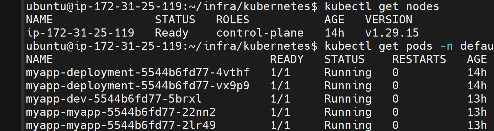
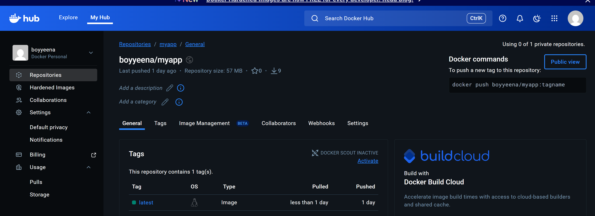
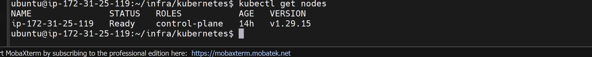
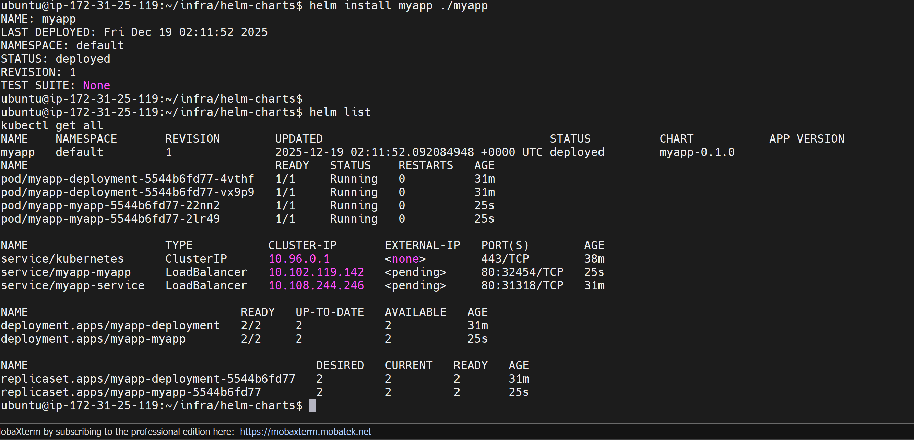
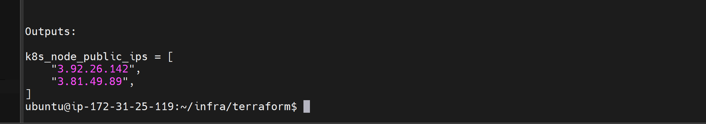
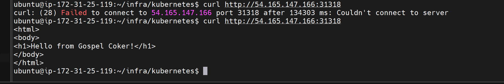
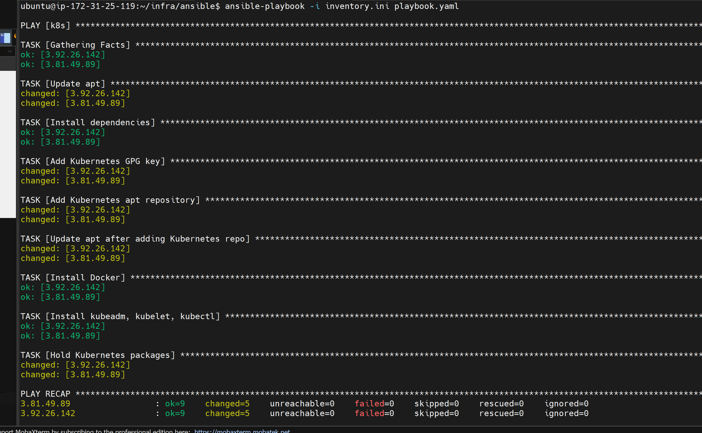

#  Kubernetes CI/CD Infrastructure with Terraform, Ansible, Docker, Helm & GitHub Actions

This project demonstrates a **production-style DevOps workflow** using ** Terraform for infrastructure provisioning**  **Ansible for infrastructure configuration**, **Docker for containerization**, **Kubernetes for orchestration**, **Helm for package management**, and **GitHub Actions for CI/CD automation**.

The purpose of this project is to show real-world DevOps fundamentals: automation, repeatability, and infrastructure-as-code.

##  Tech Stack

- **Cloud**: AWS EC2 (Ubuntu)
- **Configuration Management**: Ansible
- **Containerization**: Docker
- **Orchestration**: Kubernetes (kubeadm)
- **Package Management**: Helm
- **CI/CD**: GitHub Actions
- **Container Registry**: Docker Hub

## Screenshots

- GitHub Actions pipeline success

- Running pods

- Docker image on Docker Hub

- kubectl get pods output

- Application running in browser

- Helm release list

- Terraform Show

- Curl

- Ansible

## Problem Encounted

Initially i had problems ssh'ing into the nodes servers because in my terraform script, i mistakenly used a different ami for those servers and also one time i had to reboot the EC2 instance (which changed the public ip in that process) and ansible playbook.yaml failed to run because i didn't realize i had not changed the inbound rules but i figured out eventually.

## Key Learnings

- Public IP changes on EC2 require inventory updates

- Kubernetes packages require official repos

- SSH connectivity is the foundation of Ansible automation

- CI/CD failures are usually auth, network, or config

- DevOps is about systems, not shortcuts

## Future Improvements

- Use Elastic IPs for stable node access

- Add monitoring (Prometheus & Grafana)

## Conclusion

This project reflects real DevOps challenges and solutions:
automation, failure recovery, cloud networking, and continuous delivery.
# trigger
