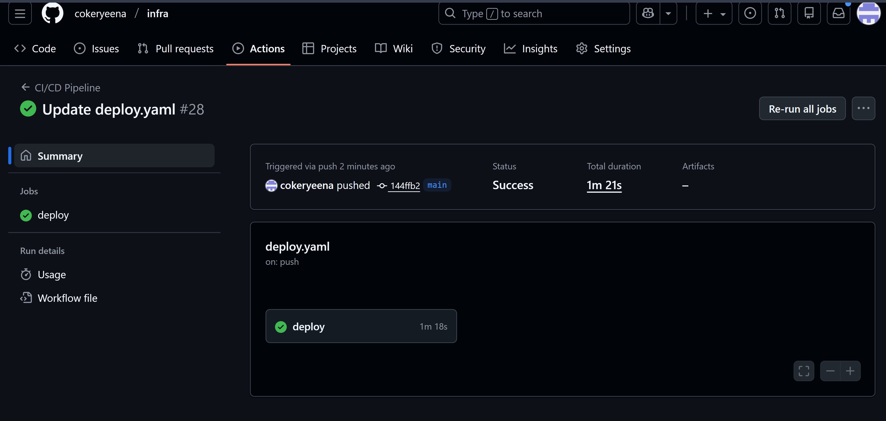
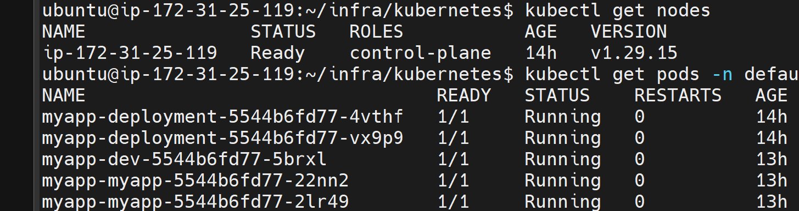
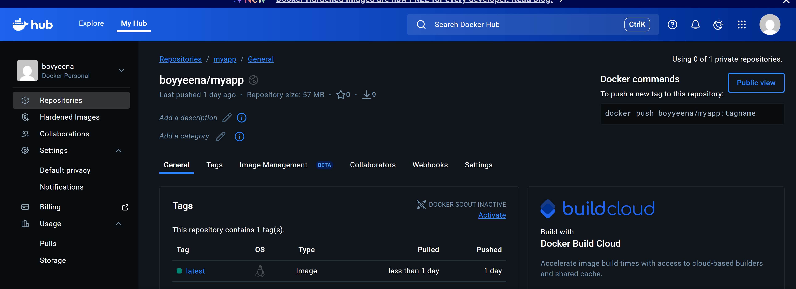
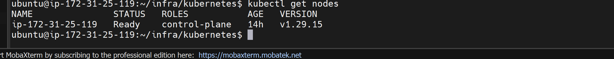
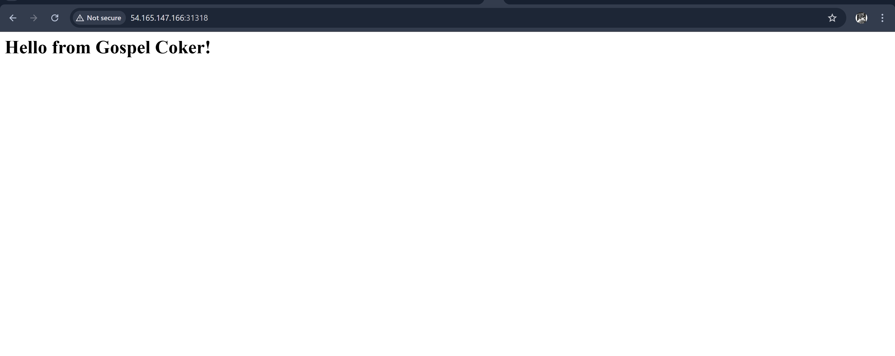
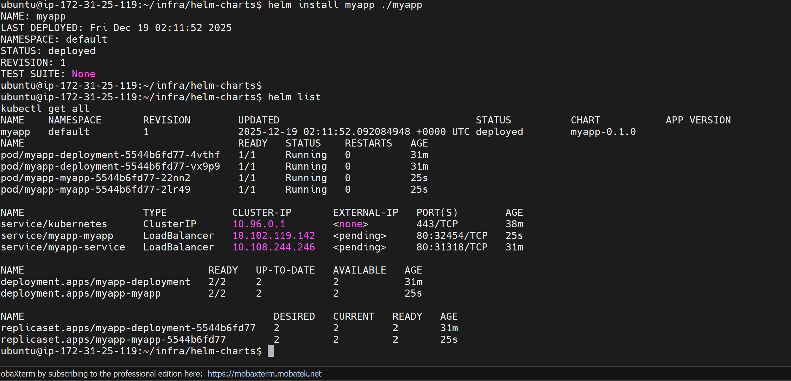
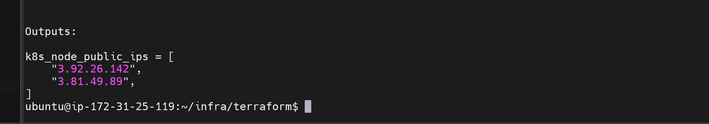
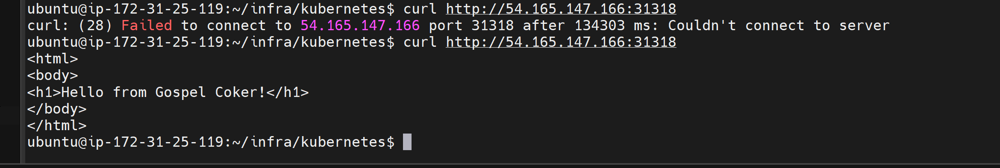
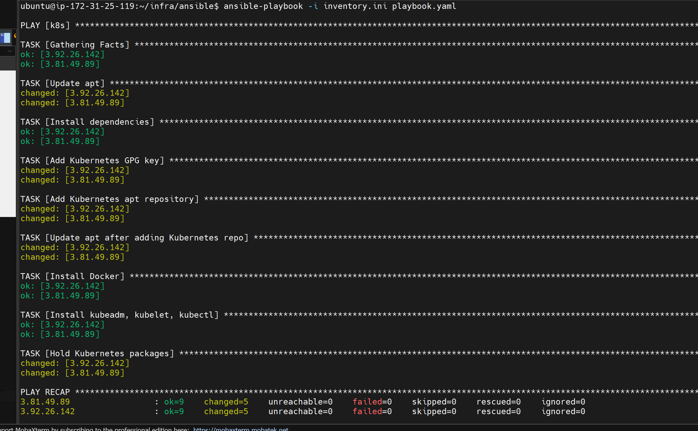

#  Kubernetes CI/CD Infrastructure with Terraform, Ansible, Docker, Helm & GitHub Actions

This project demonstrates a **production-style DevOps workflow** using ** Terraform for infrastructure provisioning**  **Ansible for infrastructure configuration**, **Docker for containerization**, **Kubernetes for orchestration**, **Helm for package management**, and **GitHub Actions for CI/CD automation**.

The purpose of this project is to show real-world DevOps fundamentals: automation, repeatability, and infrastructure-as-code.

##  Tech Stack

- **Cloud**: AWS EC2 (Ubuntu)
- **Configuration Management**: Ansible
- **Containerization**: Docker
- **Orchestration**: Kubernetes (kubeadm)
- **Package Management**: Helm
- **CI/CD**: GitHub Actions
- **Container Registry**: Docker Hub

## Screenshots

- GitHub Actions pipeline success

- Running pods

- Docker image on Docker Hub

- kubectl get pods output

- Application running in browser

- Helm release list

- Terraform Show

- Curl

- Ansible

## Problem Encounted

-Initially, I was unable to SSH into some of the EC2 nodes. This was caused by using different AMIs across nodes in the Terraform configuration, which led to inconsistent system behavior. I eventually standardized the AMI across all nodes
-After rebooting an EC2 instance, the public IP changed. This caused Ansible playbooks to fail because the inventory file and inbound security rules were no longer accurate. Fixed it by updating security group inbound rules and correcting Ansible inventory.

## Key Learnings

- Public IP changes on EC2 require inventory updates

- Kubernetes packages require official repos

- SSH connectivity is the foundation of Ansible automation

- CI/CD failures are usually auth, network, or config

## Future Improvements

- Use Elastic IPs for stable node access

- Add monitoring (Prometheus & Grafana)

## Conclusion

This project reflects real DevOps challenges and solutions:
automation, failure recovery, cloud networking, and continuous delivery.
# trigger
# trigger
